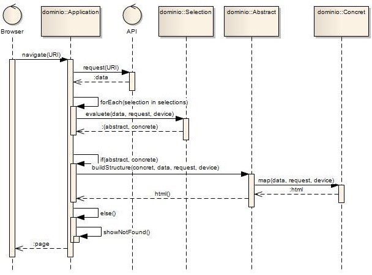
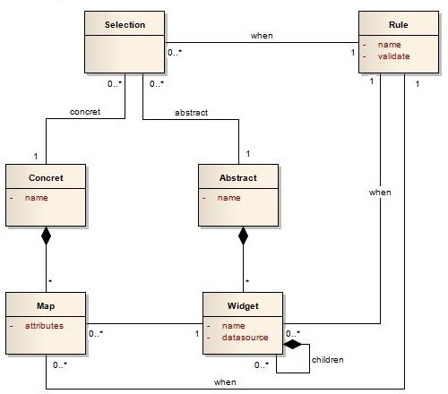
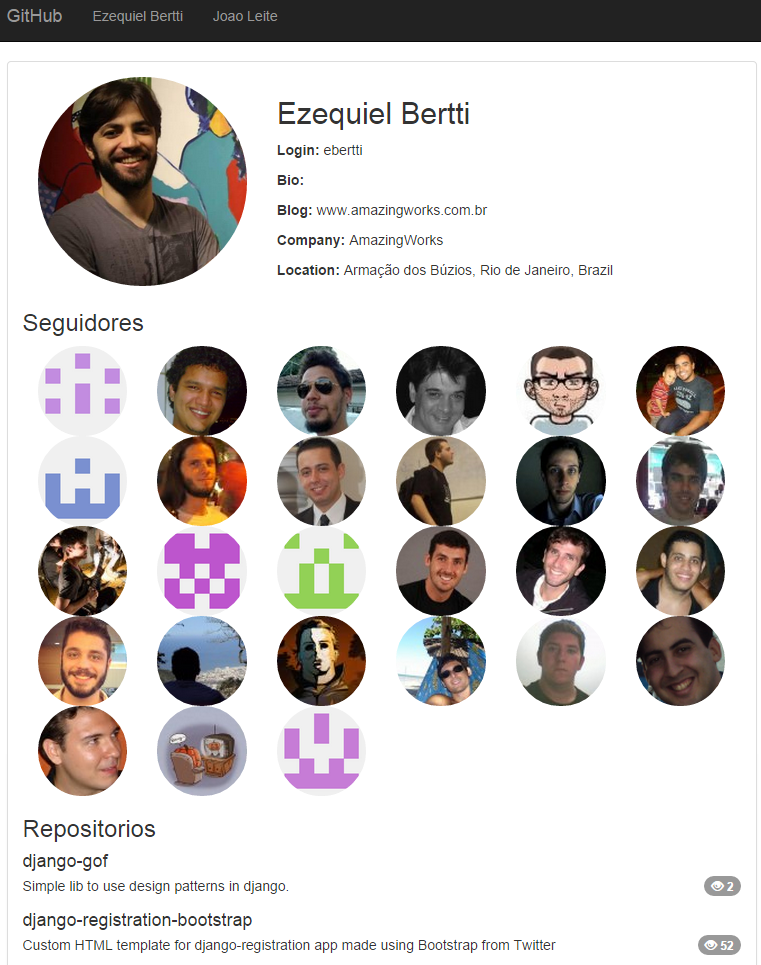

# Bem vindo ao MIRA

**Model Interface for Rest Application**

Um framework baseado em padrões que permitirá à uma aplicação qualquer definir uma interface segundo o modelo de interfaces do **SHDM**.
A funcionalidade da aplicação será ativada através de interfaces **REST**.

Através de um modelo composto por [Interface Abstrata](concrete-interface.md) e [Interface Concreta](abstract-interface.md),
o projetista da aplicação poderá montar a interface da sua aplicação e ainda utilizar [Condições](conditions.md) para
a [Seleção de Interface](interface-selection.md) e mapeamento de [Widgets](widgets.md) e [Eventos](events.md) para 
compor sua interface de acordo com suas definições e adaptando-a para diversos ambientes e dispositivos.

## Sequência de execução

A partir das URIs informadas na navegação da aplicação, o MIRA fará uma requisição para a URI, selecionará a
interface abstrata, interface concrete e montará a estrutura de widgets abstratos e mapeará os widgets concretos para
exibir as informações para o usuário. Veja o passo a passo de uma navegação para um URI de uma API REST.

### Passo a passo de navegação

#### landing

Ao acessar a aplicação, o MIRA exibe a interface abstrata e concreta com os nomes de `landing`

#### mapeando uma navegação

A partir de um widget abstrato link:

    { name: 'link' }

Com ele sendo mapeado na interface concreta `landing` como um widget com uma navegação para uma URI de uma API REST:

    { name: 'link', widget: 'SimpleHtml', tag: 'a', href: 'navigate("https://www.googleapis.com/freebase/v1/search?query=PUC")' value: 'link' }

O MIRA irá exibir este widget desta forma no HTML exibido:

    <a href="#?URI=https://www.googleapis.com/freebase/v1/search?query=PUC">link</a>

#### navegando

Quando o usuário da aplicação clicar no `link`, o MIRA irá mudar o endereço do navegador para:

    http://localhost/#?URI=https://www.googleapis.com/freebase/v1/search?query=PUC

A partir do parâmetro URI desta URL, será feita uma requisição AJAX para a API REST:

    $.get("https://www.googleapis.com/freebase/v1/search?query=PUC")

Neste momento é feita a seleção das interfaces abstrata e concreta baseada nas condições de seleção mapeadas. Toda a estrutura
de widgets abstratos e concreta é montada com base nos modelos da aplicação e a interface é exibida para o usuário que está
navegando na aplicação.

## Modelo de Domínio

## Estruturas

### Condições

O projetista tem a possibilidade de centralizar as condições que serão utilizadas posteriormente pela aplicação.

    var conditions = [{
        name: 'isUser',
        validate: '$data.login != null'
    },{
        name: 'haveWatch',
        validate: '$data.watchers_count > 0'
    },{
          name: 'hasDetail',
          validate: '$bind != null'
    }];

[Mais informações de construção de condições](conditions.md)

----
 
### Seleção de Interface

Quando há uma navegação para uma URI, será feita a seleção de interface de acordo com os dados retornados pela URI sempre
utilizando as condições definidas pelo projetista.

    var selection = [
        {
            when: 'isUser',
            abstract: 'user'
        },{
            when: 'isRepository',
            abstract: 'repository'
        }
    ];

    
[Mais informações sobre seleção de interface](interface-selection.md)

----

### Interface Abstrata

É a estrutura da interface, onde definimos a ordem, origem dos dados e hierarquia dos elementos para que sejam mapeados
pela Interface Concreta.

    var abstracts = [{
        name:"user",
        widgets:[ { name:"navigation",
            children:[ { name:"navigation-list",datasource:sourceUsers,
                children:[ { name:"navigation-list-item", bind:"$data.name" } ] } ] },
            { name:"content",
                children:[ { name:"user",
                    children:[ { name:"avatar",  bind:"$data.avatar_url" },
                        { name:"user_name", bind:"$data.name", when: 'hasDetail'},
                        { name:"login", bind:"$data.login", when: 'hasDetail' },
                        { name:"bio", bind:"$data.bio", when: 'hasDetail' },
                        { name:"blog", bind:"$data.blog", when: 'hasDetail' },
                        { name:"company", bind:"$data.company", when: 'hasDetail' },
                        { name:"location", bind:"$data.location", when: 'hasDetail' } ] },
                    { name:"follows_panel",
                        children:[ { name:"follows_title" },
                            { name:"follows", datasource:"url:<%= $data.followers_url %>",
                                children:[ { name:"follow", bind:"$data.url",
                                    children:[ { name:"follow_avatar", bind:"$data.avatar_url" } ] } ] },
                        ] },
                    { name:"repositories_panel",
                        children:[ { name:"repositories_title" },
                            { name:"repositories", datasource:"url:<%= $data.repos_url %>",
                                children:[ { name:"repository",
                                    children:[ { name:"repository_name",  bind:"$data.name" },
                                        { name:"repository_description", bind:"$data.description" },
                                        { name:"repository_watch", bind:"$data.watchers_count" } ] } ]
                        } ] } ] },
            { name:"footer" } ]
    }];

[Mais informações sobre interface abstrata](abstract-interface.md)

----

### Interface Concreta

É o mapeamento dos [Widgets Concretos](widgets.md) com a interface abstrata selecionada pela seleção de interface.

    var concret = [{
       name: 'user',
       head:[
           {name: 'main_css', widget:'Head', href:'css/bootstrap.css', tag: 'style'},
           {name: 'secondary_css', widget:'Head', href:'css/shop.css', tag:'style'},
           {name: 'viewport', widget:'Meta', content:'width=device-width, initial-scale=1'},
           {name: 'title', widget:'Title', value: '"GitHub de " + ($data.name || $data.login)'}
       ],

       structure:[
           {'user': ['avatar', {'detail': ['user_name', 'login', 'bio', 'blog', 'company', 'location']}]},
           {"repository": ['repository_name', 'repository_description', {box: ['repository_watch']}]}
       ],

       maps: [
           { name: 'navigation', widget: 'BootstrapNavigation', value:'"GitHub"'},
           { name: 'navigation-list', widget: 'BootstrapNavigationList'},
           { name: 'navigation-list-item', widget: 'BootstrapNavigationListItem', value:'$bind', href:'navigate($data.link)'},
   
           { name: 'content', widget: 'ProfileContainer' },
           { name: 'user', class:'clearfix' },
           { name: 'avatar', widget: 'ProfileImage', value:'$data.avatar_url' },
           { name: 'detail', class:'col-xs-12 col-sm-8' },
           { name: 'user_name', tag: 'h2', value: '$bind' },
           { name: 'login', widget: 'ProfileDetail', detail: 'Login', value: '$bind'},
           { name: 'bio', widget: 'ProfileDetail', detail: 'Bio', value: '$bind'},
           { name: 'blog', widget: 'ProfileDetail', detail: 'Blog', value: '$bind'},
           { name: 'company', widget: 'ProfileDetail', detail: 'Company', value: '$bind'},
           { name: 'location', widget: 'ProfileDetail', detail: 'Location', value: '$bind'},
           { name: 'follows_panel', class:'clearfix' },
           { name: 'follows_title', tag: 'h3', class:'clearfix', value:'"Seguidores"'},
           { name: 'follows' },
           { name: 'follow', tag:'a', href: 'navigate($bind)'},
           { name: 'follow_avatar', widget: 'BootstrapSimple', md:'1', xs:'2', img:'circle,responsive', tag: 'img', src: '$bind + "s=80"', alt:'$data.login', title:'$data.login'},
           { name: 'repositories_panel', class:'clearfix' },
           { name: 'repositories_title', tag: 'h3', value:'"Repositórios"'},
           { name: 'repositories' },
           { name: 'repository', class:'media'},
           { name: 'repository_name', tag: 'h4', value: '$data.name', class:'media-heading'},
           { name: 'repository_description', tag: 'span', value: '$data.description'},
           { name: 'box', tag: 'ul', class:'nav nav-pills nav-stacked pull-right'},
           { name: 'repository_watch', widget: 'ProfileCount', icon:'eye-close', value:'$bind'},
           { name: 'repository_watch', widget: 'ProfileCount', icon:'eye-open', value:'$bind', when:'haveWatch'},
   
           { name: 'footer', widget: 'TecWebRodape' }
   ]}];

[Mais informações sobre interface concreta](concrete-interface.md)

----

## Screenshot do exemplo

Navegando para uma URI da API REST do GitHub

    http://localhost/?app=example/github#?URI=https://api.github.com/users/ebertti

